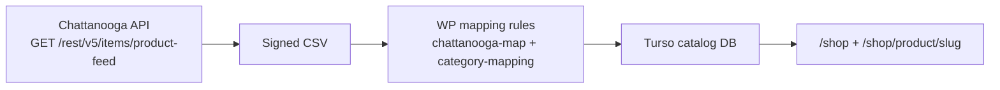

# Shop catalog — Chattanooga API → Turso DB (not Lightsail)

The Vercel storefront does **not** load products from WordPress at runtime.

## Data flow

| Step | WordPress today | Vercel store |
|------|-----------------|--------------|
| Auth | `Basic SID:md5(token)` | Same (`CHATTANOOGA_API_SID` / `TOKEN`) |
| Feed | `/items/product-feed` | Same |
| Mapping | `mgw-chattanooga-sync` | Ported in `src/lib/chattanooga/` |
| Storage | WooCommerce MySQL | **Turso** (`catalog_products` table) |
| Shop UI | WP templates | Next.js reads **only Turso** |

## Sync

- **POST** `/api/catalog/sync` — full feed → replace DB rows (Bearer `CRON_SECRET`)
- **Cron** — every 4 hours (`vercel.json`)
- **GET** `/api/catalog/sample` — inspect DB contents

## Environment

See **[ENV.md](./ENV.md)** — pull secrets from Lightsail WordPress, add Turso URL/token, push to Vercel.

| Variable | Purpose |
|----------|---------|
| `CHATTANOOGA_API_SID` / `CHATTANOOGA_API_TOKEN` | Chattanooga feed |
| `TURSO_DATABASE_URL` / `TURSO_AUTH_TOKEN` | Product database |
| `CRON_SECRET` | Protect sync endpoint + Vercel cron |

Lightsail WordPress keeps its own sync for **modulargunworks.com** until DNS cutover.
