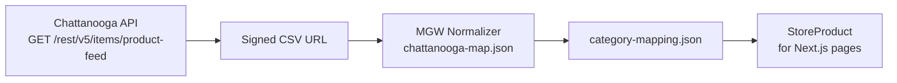

# Shop catalog — Chattanooga API (WordPress foundation)

The Vercel storefront does **not** use the old GitHub Pages static JSON. It uses the **same pipeline as your WordPress `mgw-chattanooga-sync` plugin**.

## Data flow



| Step | WordPress today | Vercel store |
|------|-----------------|--------------|
| Auth | `Basic SID:md5(token)` | Same in `lib/chattanooga/client.ts` |
| Feed | `/items/product-feed` → download CSV | Same |
| Columns | `chattanooga-map.json` | Copied to `src/data/chattanooga/` |
| Categories | `category-mapping.json` | Same file |
| Retail price | MSRP, else MAP (not dealer Price) | Same in `rules.ts` |
| Sellable | Price + image required | Same |
| NFA | Excluded from storefront | Same |

## Environment (Vercel → Settings → Environment Variables)

| Variable | Source |
|----------|--------|
| `CHATTANOOGA_API_SID` | Same as WordPress Chattanooga Sync / `.env` `API_SID` |
| `CHATTANOOGA_API_TOKEN` | Same as `API_TOKEN` |
| `CRON_SECRET` | Optional — protects `POST /api/catalog/sync` |

Never commit real credentials to GitHub.

## Inspect mapped data (before building product pages)

After env vars are set on Vercel:

```text
GET /api/catalog/sample?limit=24&top=ammunition
```

Returns sellable products mapped with `topSlug`, `subSlug`, `listPrice`, `imageUrl`, etc.

Manual sync + stats:

```text
POST /api/catalog/sync
Authorization: Bearer YOUR_CRON_SECRET
Body: { "maxSellable": 50 }
```

## Next implementation steps

1. **Persist catalog** — Neon/Turbo or Vercel Blob after each sync (not in git).
2. **Vercel Cron** — every 4 hours, same as WP `mgw_chattanooga_sync_cron`.
3. **Shop UI** — `/shop` reads persisted catalog; product page `/shop/product/[sku]` uses WP tile layout.
4. **Filters** — port Filter Everything behavior from WooCommerce meta attributes.

## Source of truth for mapping changes

Edit on Lightsail → sync to `wordpress-package/plugins/mgw-chattanooga-sync/includes/`, then copy into:

`apps/store/src/data/chattanooga/chattanooga-map.json`  
`apps/store/src/data/chattanooga/category-mapping.json`
